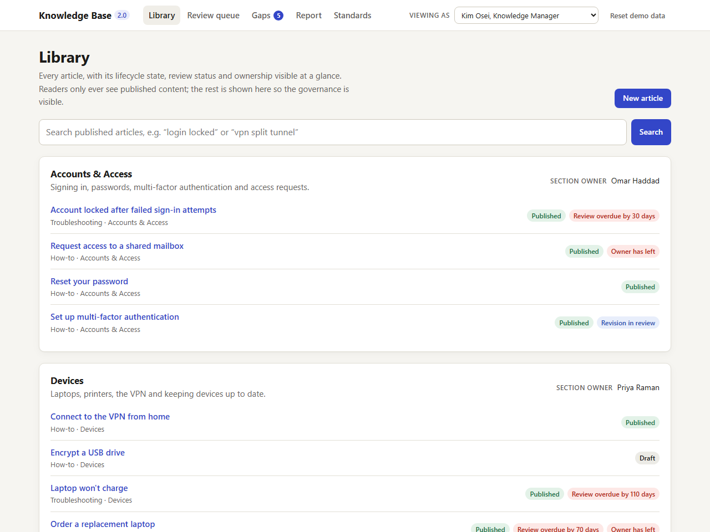
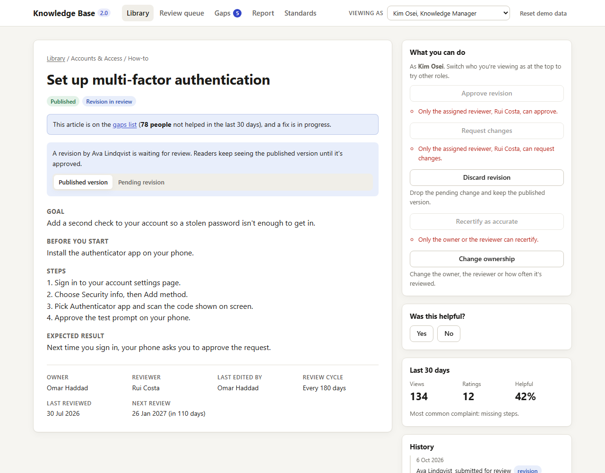
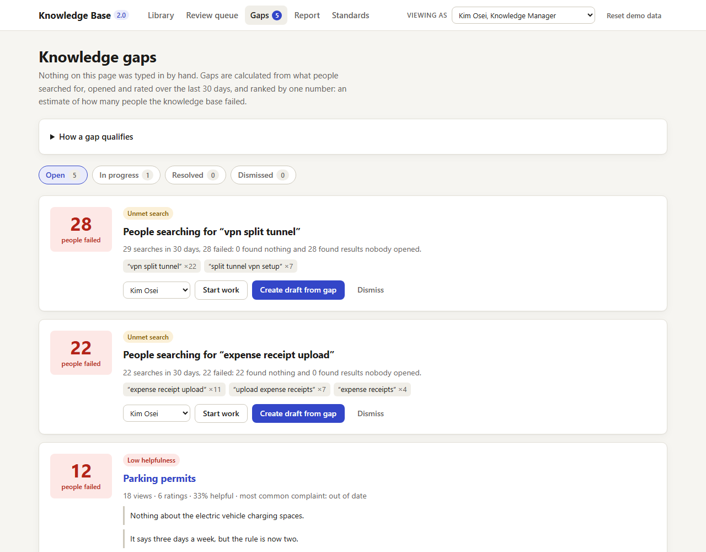
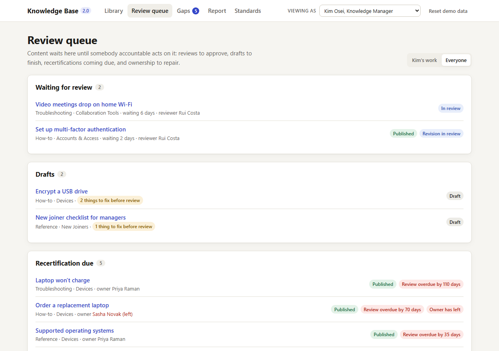
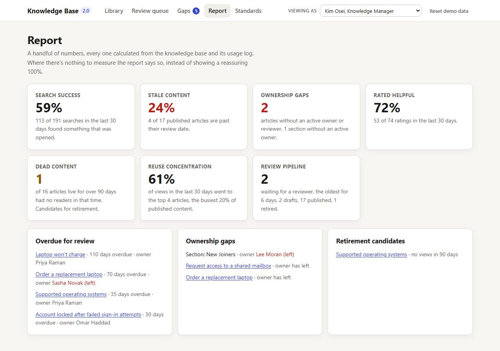

# Knowledge Base 2.0

A knowledge base where the rules that keep content trustworthy (who owns each article, when it gets reviewed, what it must contain) are enforced by the software instead of left to good intentions. It also works out from search and feedback data where the knowledge base is letting people down, and ranks those gaps by how many people they affect.

**[Open the live demo](https://cptmeowgi.github.io/knowledge-governance-demo/)**. It runs entirely in your browser, with nothing to sign up for.



## Why

Most knowledge bases fail quietly. An article goes out of date and nobody notices. The person who wrote it leaves and nobody takes it over. Someone searches, finds nothing useful and gives up, and that failure leaves no trace. The library still looks full, but people stop trusting it and go back to asking colleagues.

More content doesn't fix that. Governance does: every article has someone accountable for it, gets checked on a schedule, and follows an agreed shape and vocabulary, and the gaps are found from what people actually do rather than from what someone remembers to report. This project shows what that looks like when the tool enforces it, so the rules can't be skipped on a busy day.

The same discipline is what makes AI search and assistants trustworthy: well-structured, owned and current content is what makes retrieval reliable, because an answer can only be as good as the article it was retrieved from.

## Try it in two minutes

1. Open **Gaps**. Everything there is calculated from searches and ratings, ranked by how many people were failed.
2. Open **Set up multi-factor authentication**. You're viewing as Kim, the knowledge manager, so the approve button is disabled and says why.
3. Switch **Viewing as** to Rui Costa and approve the revision. The article's gap moves to *Resolved*.
4. On another gap, choose **Create draft from gap** and write the article with "log in" somewhere in it. Submission stays blocked until you use the agreed term, "sign in".
5. **Reset demo data** puts everything back.

## What it demonstrates

| Governance concept | How it shows up |
|---|---|
| **Article lifecycle** | Draft → In review → Published → Retired. Every change goes through one function that either applies it or returns the reasons it was refused. Editing a published article creates a pending revision, and readers keep the live version until the revision is approved. Nobody can approve their own work. |
| **Ownership** | Every article and section has an owner and a reviewer. When someone leaves, everything they own is flagged as orphaned and shows up in the review queue for someone who's allowed to fix it. |
| **Review intervals** | Each article has a review cycle, defaulted from its template. Overdue articles stay published but are labelled as stale wherever they appear, and the owner or reviewer can recertify them. |
| **Gap identification** | A ranked gaps view built from the usage log: searches that find nothing (or nothing worth opening), articles rated unhelpful, and busy articles that are overdue or underperforming. Every signal is converted to the same unit: an estimate of people failed in the last 30 days. |
| **Feedback** | "Was this helpful?" on every published article. A "no" asks for a reason and an optional comment. Ratings feed the gaps view and the report. |
| **Content standards** | Three templates (how-to, troubleshooting, reference) with required fields, plus a glossary of agreed terms. Missing fields and avoided terms block submission, and search treats the avoided terms as the agreed ones. |
| **Reporting** | Search success, the share of stale content, ownership gaps, helpfulness, dead content, reuse concentration and the review pipeline. Where there's nothing to measure, it says so instead of showing a reassuring 100%. |

## Screenshots

**An article in review.** The live version stays up while a revision waits. The actions panel shows what the current person can do, and why the rest is blocked.



**Gaps, ranked by people failed.** Each gap shows the evidence behind it and can be worked on, turned into a draft or dismissed with a reason.



**The review queue.** Reviews waiting, drafts with what's missing, recertifications due and ownership to repair.



**The report.** Every number is calculated from the content and its usage log.



## Design decisions

### Enforced versus advisory

Some rules block and some only label, and the split is deliberate.

- **Enforced:** lifecycle transitions, who may do what, required template fields, glossary terms, no self-approval, and people who have left can't act. These are cheap to comply with and expensive to get wrong.
- **Advisory:** review dates. An overdue article is often still the best answer available, so it stays published with a visible label and lands in its owner's queue. Hiding it would turn a quality problem into a gap.

### Gaps are derived, not self-reported

Nobody types a gap in. Searches, views and ratings are an append-only log, and gaps are calculated from that log every time. The only thing stored about a gap is how it's being handled: in progress (who's on it, and which article will fix it) or dismissed (with a reason). A gap resolves itself once its linked article is approved, and a dismissed gap reopens on its own if the evidence doubles. That keeps the list honest: nobody can close a gap by editing a spreadsheet.

### One unit for ranking

A failed search, an unhelpful rating and a busy overdue article are different signals. Each is converted to the same estimate, people failed, so they can be ranked against each other. Every threshold lives in one policy file ([`src/domain/policy.ts`](src/domain/policy.ts)) and is listed on the Standards page.

### Rules separate from screens

All the rules live in [`src/domain`](src/domain) as plain TypeScript functions with no UI code in them, each covered by unit tests. The screens only call them. The full model is written up in [`docs/design.md`](docs/design.md).

### What I'd add next

- Identity and permissions from a real directory, replacing the "Viewing as" switcher.
- A server-side store and event pipeline, so usage comes from real searches rather than a seed.
- Reminders before a review falls due, and a weekly digest for owners.
- Better search-quality signals than clicks, such as reformulated queries and time on page.
- Policies per section, for example shorter review cycles for security content.
- An export of governed articles, with owner and review metadata, to an AI retrieval index.

## Running it locally

You need a current Node.js LTS release.

```bash
npm install && npm run dev
```

There's no backend, no account and no environment variable. Changes are saved in your browser's local storage. If storage is blocked, the demo still works until you reload.

```bash
npm test
```

That runs 97 unit tests covering the domain rules and the demo's starting story. `npm run typecheck` and `npm run build` do what they say.

## How it's built

React 19, TypeScript and Vite, with no router, UI kit or state library, and plain CSS.

- `src/domain`: the rules (lifecycle, review, ownership, glossary, search, gaps, report, policy) and their tests.
- `src/data`: the invented seed. People, sections, articles and usage profiles are expanded into about 4,000 usage events, dated relative to today, so the demo never goes stale itself.
- `src/store`: application state and saving to local storage.
- `src/views`: the screens.

---

Knowledge Base 2.0 is an independent demonstration project built with invented sample data. Released under the [MIT licence](LICENSE).
